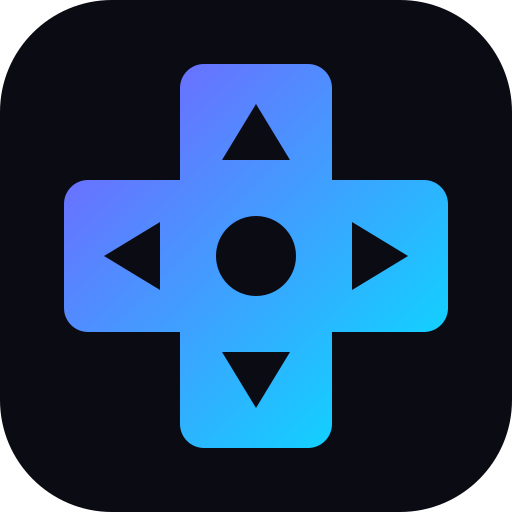

<div align="center">



# Playdeck

[](LICENSE) [](https://tanstack.com/start) [](https://react.dev) [](https://www.typescriptlang.org) [](https://tailwindcss.com)

**Doomscrolling, except every card is a game you can actually win.**

A deck of 32 bite-sized games dealt as an endless vertical feed. Swipe down,
play a thirty-second run, and keep going — every game tracks **its own level**
that climbs as you beat it, so the deck gets harder the longer you play.

[**Try it live**](https://kaushalmeena.github.io/playdeck/)

</div>

---

## Features

- **An endless deck** — 32 games in a vertical snap-scroll loop that never
  runs out, paged one card per flick by wheel, swipe, arrow keys or `Space`.
- **Per-game levels** — each game remembers your level and scales its own
  difficulty from it; a win raises it, so the feed grows with you.
- **Combo scoring** — consecutive wins build a multiplier up to ×3 that feeds
  a single global score, and one loss resets it.
- **Unlock waves** — eight games are free and every 250 points opens four
  more, so the catalogue reveals itself as you play.
- **Daily challenge** — three date-seeded games, identical for every player,
  worth a bonus and a streak, with a shareable result card.
- **A shuffled deck** — the running order is reshuffled each session, while
  unlocking stays tied to each game's fixed rank.
- **Games are single files** — one `*.game.tsx` per game, auto-discovered by
  the registry; add or delete a file and the feed follows.
- **Sound and haptics** — synthesized cues for every interaction and in-game
  action, with one toggle to mute the lot; nothing to download.
- **Installable and offline** — a PWA with a service worker, light and dark
  themes, and all progress kept locally in the browser.

## How It Works

1. **Discover** — the registry globs `src/games/*.game.tsx` at build time, so
   the feed knows every card without a manifest.
2. **Scroll** — the list is rendered three times over and the player sits in
   the middle copy. When scrolling settles in an outer copy the feed jumps one
   list-length, which looks identical and restores the runway in both
   directions.
3. **Mount** — only the active card and its immediate neighbours are mounted,
   so at most three games hold timers or animation frames at a time.
4. **Play** — starting a run freezes the feed and hands the game the screen.
   Games claim their keys in the capture phase, so arrows and `Space` steer
   the game instead of paging the feed.
5. **Score** — finishing reports a score, which is multiplied by the current
   combo, added to the global total, and — on a win — raises that game's
   level for next time.

> No accounts and no backend. Scores, levels, favourites and streaks live in
> your browser's `localStorage`, and the app keeps working offline.

## Tech Stack

| Area           | Tools                                                                                              |
| -------------- | -------------------------------------------------------------------------------------------------- |
| **Framework**  | [TanStack Start](https://tanstack.com/start) · [React 19](https://react.dev) · [TypeScript](https://www.typescriptlang.org) |
| **Styling**    | [Tailwind CSS 4](https://tailwindcss.com)                                                          |
| **Routing**    | [TanStack Router](https://tanstack.com/router) with the View Transitions API                       |
| **UI**         | [Sonner](https://sonner.emilkowal.ski) (toasts) · [canvas-confetti](https://github.com/catdad/canvas-confetti) |
| **Rendering**  | Canvas 2D · Web Audio API · Web Share API                                                          |
| **Testing**    | [Vitest](https://vitest.dev) (unit)                                                                |
| **Tooling**    | [Vite](https://vite.dev) · [Biome](https://biomejs.dev) (lint + format)                            |

## Getting Started

These instructions will get you a copy of the project up and running on your
local machine for development purposes.

### Requirements

To install and run this project you need:

- [Node.js](https://nodejs.org/) `>=22`
- [npm](https://docs.npmjs.com/downloading-and-installing-node-js-and-npm)
- [git](https://git-scm.com/downloads) (only to clone this repository)

### Installation

To set up everything on your local machine, follow these steps:

1. Clone this repo and then change directory to the `playdeck` folder:

```bash
git clone https://github.com/kaushalmeena/playdeck.git
cd playdeck
```

2. Install project dependencies using npm:

```bash
npm install
```

### Running

To run the project simply run:

```bash
npm run dev
```

Your app should now be running on [localhost:5173](http://localhost:5173/).

### Testing

To run the unit tests:

```bash
npm test
```

To lint and format-check the project:

```bash
npm run check
```

### Building

To create a production build:

```bash
npm run build
```

Every route is prerendered to static HTML, so the build needs no server. The
output is written to `dist`, and the deployable site is `dist/client`.

## Deployment

Every push to `main` is checked, tested, built and deployed to GitHub Pages by
the [deploy workflow](.github/workflows/deploy.yml).

Because a project site is served from `/<repo>/`, the workflow builds with
`BASE_PATH` set from the repository name, and Vite and the router pick that up
as their base. Building locally without it keeps everything at `/`.

One-time setup: in the repository's **Settings → Pages**, set **Source** to
**GitHub Actions**.

## Documentation

Full documentation is available in the [`/docs`](./docs) directory.

**Contributing a Game:**

- [Adding a Game](./docs/adding-a-game.md) — the one-file game contract, the
  run lifecycle, and the kit helpers a game can use.
- [The Games](./docs/games.md) — every game in the feed and how each one gets
  harder as your level climbs.

**Under the Hood:**

- [Architecture](./docs/architecture.md) — how the infinite feed, wheel
  paging, progression and scoring fit together, and what is unit-tested.

## Contributing

Contributions are welcome! If you find a bug or have a feature request, please
[open an issue](https://github.com/kaushalmeena/playdeck/issues/new/choose)
first to discuss it. For code changes, fork the repository, create a branch,
and open a pull request.

New games are especially welcome — see
[Adding a Game](./docs/adding-a-game.md).

## License

This project is licensed under the MIT License — see the [LICENSE](LICENSE)
file for details.
